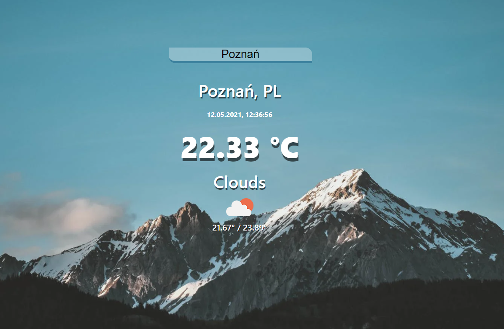

<h1 align="center">Weather-app</h1>

  

## Project Overview 🎉
A simple and lightweight application for checking the current weather for a given city, written in React.

## Tech/framework used 🔧

| Tech                                                    | Description                              |
| ------------------------------------------------------- | ---------------------------------------- |
| [React]()                           | Used to build the application   |
| [CSS](X)                           | Used to stylize the application|

## Installation 💾
Clone this repo to your desktop and run  `npm install`  to install all the dependencies.
Once the dependencies are installed, you can run  `npm start`  to start the application. You will then be able to access it at localhost:3000
## Available scripts

| Command                   | Description                   |     
| ------------------------- | ----------------------------- | 
| `npm start`           | Open local server             |     
| `npm build`           | Create optimized build        |     
| `npm test`            | Run tests                     |     

## Live 📍
https://miedzinskijakub.github.io/Weather-app/

